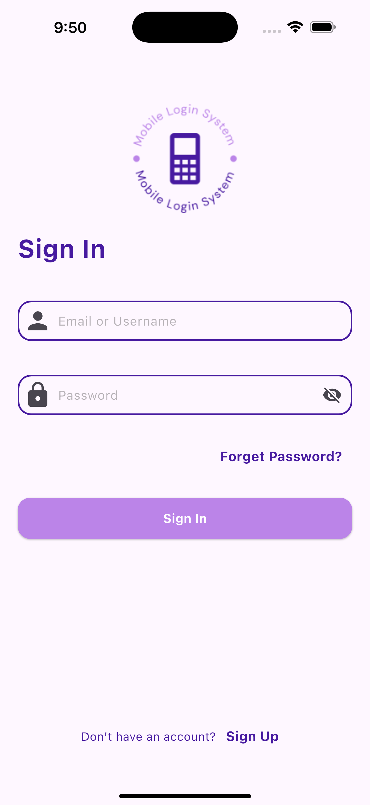
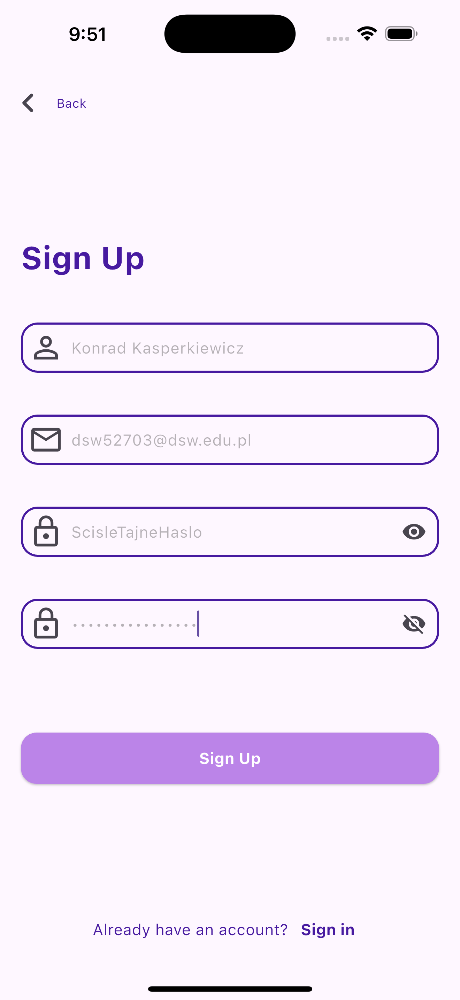
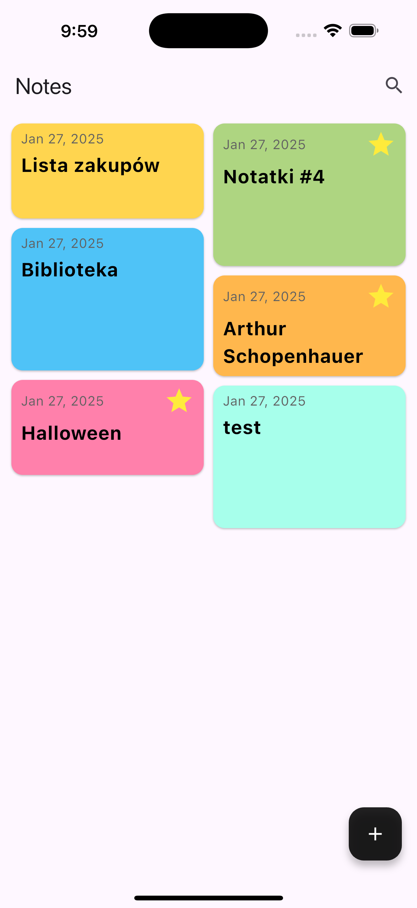
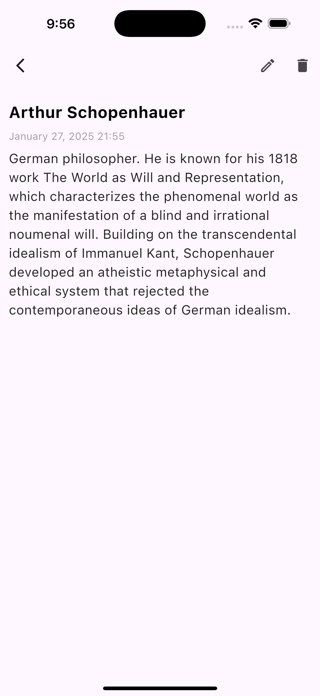
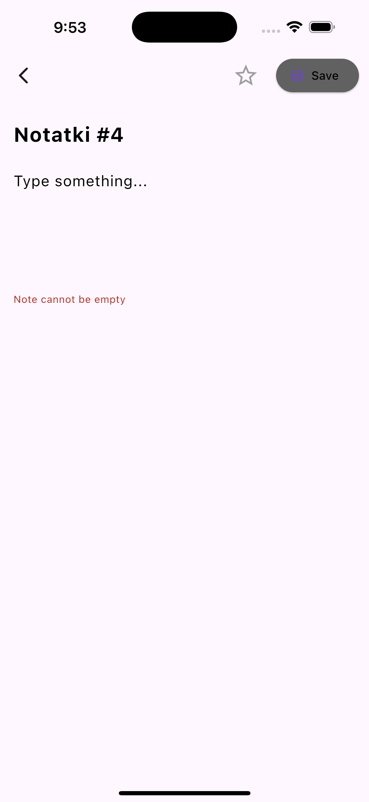
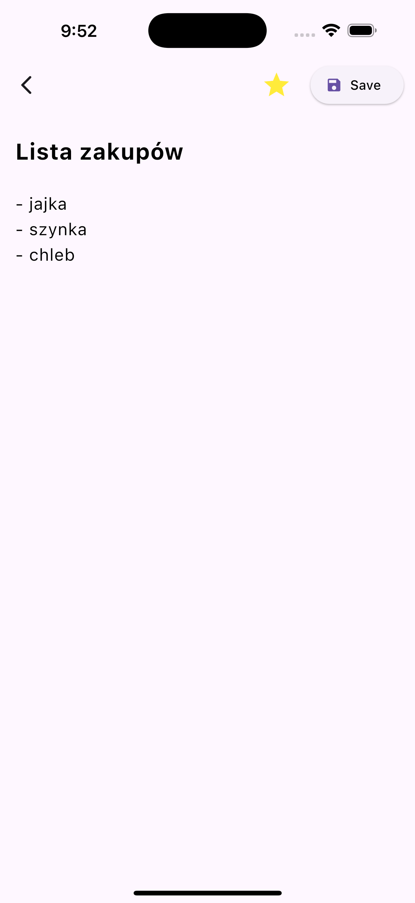

#################################################
Wykonał: Konrad Kasperkiewicz, 52703
Repozytorium: github.com/bihius/simple-notes-app
#################################################

edit1: przepraszam za ucięte zrzuty ekranu, niestety mój edytor markdown ma problem z eksportem do pdf

# Projekt flutter
Projekt ten jest aplikacją mobilną napisaną w języku Dart przy użyciu frameworka Flutter. W aplikacji tej użytkownik może tworzyć notatki oraz je edytować. Notatki te są zapisywane w bazie SQLite. Do aplikacji użytkownik musi się autoryzować za pomocą danych, które są również zapisywane w bazie SQLite. Informacje o tym, czy użytkownik jest zalogowany i na jakie konto, przechowywane są w Shared Preferences.

## Struktura projektu
Aplikacja składa się z kilku głównych ekranów:

### LoginScreen
Ekran logowania, na którym użytkownik wprowadza swoje dane logowania (email lub nazwę użytkownika oraz hasło). Ekran ten zawiera:
- `TextFormFieldWithIcon` do wprowadzania emaila lub nazwy użytkownika.
- `TextFormFieldWithIcon` do wprowadzania hasła, z możliwością jego ukrycia/odkrycia.
- Przycisk "Sign In" (`pinkButton`), który po kliknięciu sprawdza dane logowania i przekierowuje użytkownika do `HomeView` w przypadku poprawnych danych.
- Link "Forget Password?" oraz "Sign Up" do odpowiednich ekranów.

### RegisterScreen
Ekran rejestracji, na którym użytkownik może utworzyć nowe konto. Ekran ten zawiera:
- `TextFormFieldWithIcon` do wprowadzania imienia.
- `TextFormFieldWithIcon` do wprowadzania emaila.
- `TextFormFieldWithIcon` do wprowadzania hasła oraz jego potwierdzenia.
- Przycisk "Sign Up" (`pinkButton`), który po kliknięciu rejestruje nowego użytkownika, zapisuje jego email w shared prefences i przekierowuje go do `LoginView`.
- Link "Sign in" do ekranu logowania.

### HomeScreen
Ekran główny, na którym użytkownik może przeglądać swoje notatki. Ekran ten zawiera:
- `AppBar` z tytułem "Notes" oraz ikoną wyszukiwania (nie działająćą).
- `StaggeredGridView` do wyświetlania notatek w formie kart (`NoteCardWidget`).
- `FloatingActionButton` do dodawania nowych notatek, który przekierowuje do `AddEditNoteView`.

### NoteScreen
Ekran szczegółów notatki, na którym użytkownik może przeglądać wybraną notatkę. Ekran ten zawiera:
- `AppBar` z przyciskami edycji i usuwania notatki.
- `ListView` do wyświetlania tytułu, daty utworzenia oraz treści notatki.

### AddNoteScreen
Ekran dodawania/edycji notatki, na którym użytkownik może tworzyć nowe notatki lub edytować istniejące, oraz oznaczyć notatkę jako ulubiona. Ekran ten zawiera:
- `NoteFormWidget` z polami do wprowadzania tytułu oraz treści notatki.

## Technologie
- Dart
- Flutter
- SQLite
- Shared Preferences

## Pliki projektu

### `lib/main.dart`
Plik główny aplikacji, który inicjalizuje aplikację i sprawdza, czy użytkownik jest zalogowany. W zależności od tego, przekierowuje do `LoginView` lub `HomeView`.

### `lib/views/login/login_view.dart`
Zawiera implementację ekranu logowania (`LoginView`). Używa `TextFormFieldWithIcon` do wprowadzania danych logowania oraz `pinkButton` do logowania użytkownika.

### `lib/views/register/register_view.dart`
Zawiera implementację ekranu rejestracji (`RegisterView`). Używa `TextFormFieldWithIcon` do wprowadzania danych rejestracyjnych oraz `pinkButton` do rejestracji nowego użytkownika.

### `lib/views/home/home_view.dart`
Zawiera implementację ekranu głównego (`HomeView`). Wyświetla listę notatek w formie kart (`NoteCardWidget`) oraz umożliwia dodawanie nowych notatek za pomocą `FloatingActionButton`.

### `lib/views/home/note_detail_view.dart`
Zawiera implementację ekranu szczegółów notatki (`NoteDetailPage`). Wyświetla tytuł, datę utworzenia oraz treść notatki. Umożliwia edycję i usuwanie notatki.

### `lib/views/widgets/note_card.dart`
Zawiera implementację widżetu karty notatki (`NoteCardWidget`). Wyświetla tytuł, datę utworzenia oraz ikonę ulubionej notatki.

### `lib/views/widgets/note_form.dart`
Zawiera implementację formularza notatki (`NoteFormWidget`). Umożliwia wprowadzanie tytułu oraz treści notatki.

### `lib/views/widgets/back_button.dart`
Zawiera implementację przycisku powrotu (`backButton`). Umożliwia powrót do poprzedniego ekranu.

### `lib/views/widgets/basic_text_form_field.dart`
Zawiera implementację widżetu `TextFormFieldWithIcon`, który jest używany do wprowadzania danych w formularzach.

### `lib/views/widgets/header_text.dart`
Zawiera implementację widżetu `headerText`, który wyświetla nagłówek tekstu.

### `lib/views/widgets/pink_button.dart`
Zawiera implementację widżetu `pinkButton`, który jest używany jako przycisk w aplikacji.

I parę innych plików, których opisywanie tu minełoby się z celem...

## Wyzwania

Na początku największym (urojonym) wyzwaniem było stworzenie całego layoutu na ekranie logowania. Okazało się jednak, że stworzenie tego nie było wcale takie trudne. Trudności dopiero pojawiły się w szczegółach, lub raczej dopiero po ich zauważeniu - przycisk do odkrycia hasła zagwiastkowywał po kliknięciu pole loginu - z problemem tym borykałem się całkiem sporo czasu, ponieważ wymagałem od siebie najprostszego ale i najbardziej logicznego rozwiązania. Kolejnym problemem, drobnym lecz bardzo denerwującym, okazały się wartości w `InitialValue`. Uważam, że nie skorzystałbym z aplikacji, która automatycznie usuwa domyślną zawartość pól tekstowych po kliknięciu w nie, stąd też musiałem się zapoznać z mechanizmami controllera oraz focusnode aby to naprawić.

Kolejnym problemem, który napotkałem, dotyczył obsługi bazy danych. Okazało się, że potrzeba dużo czasu na zrozumienie, jak działa SQLite w Flutterze, i jak z niego korzystać w "rozsądny" sposób. Niestety, nie udało mi się zaimplementować wszystkich funkcjonalności, które chciałem, ale jestem zadowolony z tego, co udało mi się osiągnąć. Przede wszystkim brakuje korelacji między notatkami a użytkownikami, co uniemożliwia zapisywanie notatek dla konkretnego użytkownika.

Ikonka do wyszukiwania oraz "Forget Password" nie działają, ponieważ nie zdążyłem zaimplementować ich w całości.

## Wnioski
- Nauka Fluttera: Tworzenie tej aplikacji pozwoliło mi na głębsze zrozumienie frameworka Flutter. Praca z różnymi widżetami i zarządzanie stanem aplikacji były kluczowymi elementami, które pomogły mi lepiej zrozumieć, jak działa Flutter.
- Obsługa baz danych: Implementacja SQLite w aplikacji była wyzwaniem, ale również cenną lekcją. Zrozumienie, jak działa lokalna baza danych i jak efektywnie zarządzać danymi, było kluczowe dla sukcesu projektu.
- Zarządzanie stanem: Praca z formularzami i walidacją danych nauczyła mnie, jak ważne jest zarządzanie stanem w aplikacji. Użycie TextEditingController i GlobalKey<FormState> było niezbędne do poprawnego działania formularzy.
- Interfejs użytkownika: Tworzenie intuicyjnego i estetycznego interfejsu użytkownika było jednym z głównych celów projektu. Użycie spójnych widżetów, takich jak TextFormFieldWithIcon i pinkButton, pomogło w osiągnięciu tego celu.
- Debugowanie i testowanie: Podczas tworzenia aplikacji napotkałem wiele problemów, które wymagały debugowania i testowania. Było to cenne doświadczenie, które nauczyło mnie, jak ważne jest dokładne testowanie aplikacji na różnych etapach jej tworzenia.
- Brakujące funkcjonalności: Nie udało mi się zaimplementować wszystkich planowanych funkcjonalności, takich jak wyszukiwanie notatek i resetowanie hasła. Było to cenne doświadczenie, które nauczyło mnie, jak ważne jest realistyczne planowanie i priorytetyzacja zadań.

## Zrzuty ekranu
### LoginScreen

### RegisterScreen

### HomeScreen

### NoteScreen

### AddNoteScreen

### AddNoteScreen

